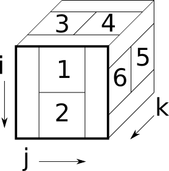
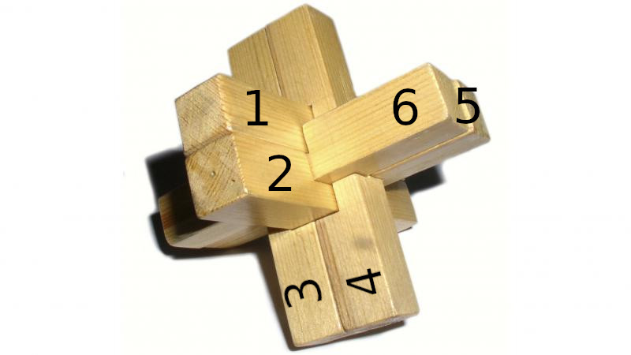

# Tømmerknude

[](https://tp2750.github.io/Tømmerknude.jl/stable)
[](https://tp2750.github.io/Tømmerknude.jl/dev)
[](https://github.com/tp2750/Tømmerknude.jl/actions)
[](https://codecov.io/gh/tp2750/Tømmerknude.jl)

Based on this article:
https://ing.dk/artikel/kan-du-lose-gordiske-tommerknude-249110

# Plan

* The `knot` consists of 4x4x4 voxels.
* A `stick` is 2x2x4 voxels. 
* A Stick has a unique `key` describing which voxels are filled and empty
* The knot has 6 `slots`. 
* A `Position` is a stick assigned a slot and a rotation.
* A `configuration` is an assignment of slot and rotation to all 6 sticks
* A valid configuration has all 6 sticks assigned to slots and rotations so that there are no overlaps in the knot

# Example:

The simplest stick has key:

```{julia}
julia> reshape([1,1,1,1,0,1,1,1,1,1,0,1,0,1,1,1],(2,4,2))
2×4×2 Array{Int64, 3}:
[:, :, 1] =
 1  1  0  1
 1  1  1  1

[:, :, 2] =
 1  0  0  1
 1  1  1  1
```

The indexes run: down, across, forward as in an array.


# Slots

The slots are subsets of 4x4x4 voxels:


Slot 1 is zero everywhere (i, j, k) except where i: 1..2, j: 2..3, k: 1..4.

## Overlap of slots

Finding the overlap of slots in terms of pixes is just adding the arrays (and checking the sum to be > 1).

# Finding overlap

We represent the `stick`s as 2x4x2 arrays and the slots as subsets of the 4x4x4 `knot`.
The orientation is shown in the figures below.




We can immediately assing a stick to slots 5 or 6 as:

``` julia
 s = zeros(Int64,4,4,4)
 s[2:3,1:4,1:2] = Stick(1, [0,1,2,0,0,0,0,0]).key ## Slot 5
 s
4×4×4 Array{Int64, 3}:
[:, :, 1] =
 0  0  0  0
 1  1  0  1
 1  1  1  1
 0  0  0  0

[:, :, 2] =
 0  0  0  0
 1  0  0  1
 1  1  1  1
 0  0  0  0

[:, :, 3] =
 0  0  0  0
 0  0  0  0
 0  0  0  0
 0  0  0  0

[:, :, 4] =
 0  0  0  0
 0  0  0  0
 0  0  0  0
 0  0  0  0
```

However, we can not assign to slot 1:

```
 s = zeros(Int64,4,4,4)
 s[1:2,2:3,1:4] = Stick(1, [0,1,2,0,0,0,0,0]).key ## Slot 1
 ERROR: DimensionMismatch("tried to assign 2×4×2 array to 2×2×4 destination")
```

A way to fix this is by rotating the `knot` before assigning, and then rotate it back.

Julia has the function `rotr90` to rotate a matrix clockwise:


``` julia
julia> reshape(1:16,(4,4))
4×4 reshape(::UnitRange{Int64}, 4, 4) with eltype Int64:
 1  5   9  13
 2  6  10  14
 3  7  11  15
 4  8  12  16

julia> rotr90(reshape(1:16,(4,4)))
4×4 Matrix{Int64}:
  4   3   2   1
  8   7   6   5
 12  11  10   9
 16  15  14  13

```

We can apply that to our `knot` through `mapslices()`:

``` julia
julia> a = reshape(1:8,(2,2,2))
2×2×2 reshape(::UnitRange{Int64}, 2, 2, 2) with eltype Int64:
[:, :, 1] =
 1  3
 2  4

[:, :, 2] =
 5  7
 6  8

## Front clockwise (colons in 1,2)
julia> mapslices(rotr90,a; dims=(1,2))
2×2×2 Array{Int64, 3}:
[:, :, 1] =
 2  1
 4  3

[:, :, 2] =
 6  5
 8  7

## Top clockwise (colons in 2,3)

julia> mapslices(rotr90,a; dims=(2,3))
2×2×2 Array{Int64, 3}:
[:, :, 1] =
 3  7
 4  8

[:, :, 2] =
 1  5
 2  6
```

It looks like it is working:

``` julia
julia> Tømmerknude.voxels(1,Tømmerknude.stick_set[1].key)
4×4×4 Array{Int64, 3}:
[:, :, 1] =
 0  1  1  0
 0  1  1  0
 0  0  0  0
 0  0  0  0

[:, :, 2] =
 0  0  0  0
 0  1  1  0
 0  0  0  0
 0  0  0  0

[:, :, 3] =
 0  1  0  0
 0  1  1  0
 0  0  0  0
 0  0  0  0

[:, :, 4] =
 0  1  1  0
 0  1  1  0
 0  0  0  0
 0  0  0  0
```

Mapslice code:

* (1,2): [i,j] Front
* (2,3): [j,k] Top
* (1,3): [i,k] Right

TODO make sure to use `rotr90` and `rotl90` correctly.

# Solutions!

Here's a solution:

``` julia
julia> Tømmerknude.print_solution(r)
4×4×4 Array{Int64, 3}:
[:, :, 1] =
 0  1  1  0
 4  1  1  4
 4  4  4  4
 0  5  5  0

[:, :, 2] =
 2  1  0  6
 4  1  1  4
 4  4  5  4
 2  5  5  6

[:, :, 3] =
 2  1  6  6
 2  1  6  6
 2  3  3  6
 2  0  5  6

[:, :, 4] =
 0  1  1  0
 3  1  1  3
 3  3  3  3
 0  5  5  0
```
